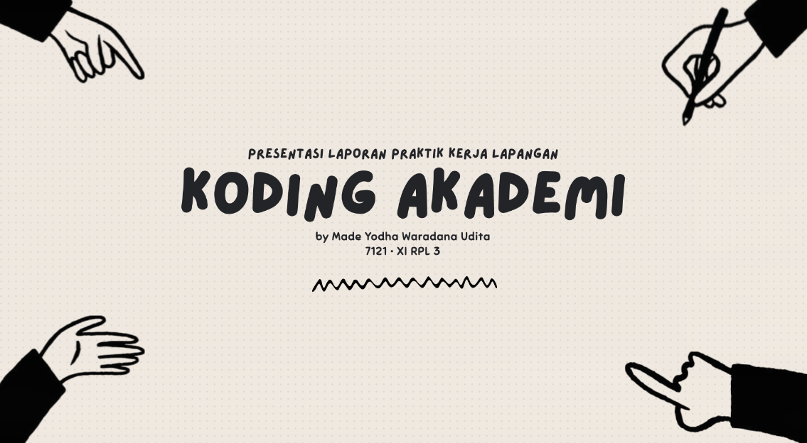

<h1 align="center">
  Internship Report Presentation Website
</h1>

<p align="center">
  Interactive presentation website built with React, TailwindCSS, and GSAP.
  <br />
  Designed to feel like actual Canva presentation slides instead of a traditional responsive website.
</p>

<br />

<p align="center">
  
</p>

<br />

> [!IMPORTANT]
>
> This website intentionally does **NOT** use traditional responsive layouts.
>
> Instead, the entire presentation scales dynamically using viewport-based scaling to keep the exact slide layout across different screen sizes.
>
> Yup.
>
> It's basically a fake PowerPoint made with React *smug_bunny_face.png (yes, i love adding this .png things).

## 🐇 Concept

Since this is a presentation website, i made it so it'll scales dynamically on every screen sizes using viewport calculations. You might think that every slides here is an image, but NO. it actually is an HTML.. lol.

The layout is inspired heavily by Canva and https://www.canva.com/templates/EAF6p28ot2w/ template. Tho, the final implementations were recreated manually in React.

## Built With

- React
- TailwindCSS
- GSAP
- Vite

## How to Running Locally

Clone the repository:

```bash
git clone https://github.com/wein1m/PKL-presentation-web.git
```

Install dependencies:

```bash
npm install
```

Run the development server:

```bash
npm run dev
```

## 🐇 Funfact

This project started as a simple & normal school assignment, but somehow it looks hella cool so i make this repo public lol.

<p align="center"> 👻 EOF </p>
